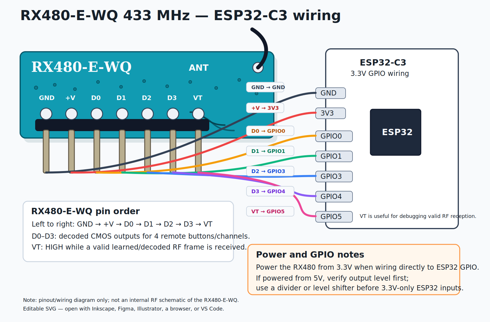

# RX480-E-WQ + ESP32-C3 Rust

License: MIT


Rust workspace for reading and debugging an **RX480-E-WQ / RX480E-4** RF receiver module. It includes a HAL-agnostic `embedded-hal` driver crate that classifies `D0`-`D3`/`VT` output pins as structured state, plus an **ESP32-C3** debug firmware using `esp-hal`.



## Scope

This repository's board firmware is **ESP32-C3 only**. The `rx480e-wq-driver` crate is hardware-agnostic and uses `embedded-hal` input-pin traits.

- Firmware target: `riscv32imc-unknown-none-elf`
- HAL: `esp-hal` with the `esp32c3` feature
- Flash tool: `espflash`
- Current board binary package: `esp32-c3-rx480e-wq`
- Driver package: `rx480e-wq-driver`

## What the RX480-E-WQ is

The RX480-E-WQ/RX480E-4 is not a frequency scanner and not a transmitter. It is a fixed-frequency RF receiver plus decoder.

According to QIACHIP's RX480E-4 manual, it is a 433.92 MHz learning-code superheterodyne receiver for 1527/learning-code style remotes, with four CMOS-level data outputs and a valid-transmission output. [1]

Pins:

| RX480 pin | Meaning |
|---|---|
| `GND` | Ground |
| `+V` | Supply, typically 3.3-5 V depending on board/module |
| `D0` | Decoded channel output 0 |
| `D1` | Decoded channel output 1 |
| `D2` | Decoded channel output 2 |
| `D3` | Decoded channel output 3 |
| `VT` | Valid Transmission indicator |

Important behavior from the manual and vendor notes: [1][2][3]

- `D0-D3` are **decoded channel outputs**, not raw RF data.
- `VT` goes active when a valid decoded RF frame is received.
- The module must learn/pair a compatible remote before channel outputs are useful.
- Output modes include momentary/inching, toggle/self-lock, and interlock/latching.
- The module cannot replay/transmit RF.
- The module cannot scan or identify arbitrary RF frequencies.

## Current ESP32-C3 wiring

Firmware currently expects this wiring:

| RX480-E-WQ | ESP32-C3 |
|---|---:|
| `D0` | `GPIO0` |
| `D1` | `GPIO1` |
| `D2` | `GPIO3` |
| `D3` | `GPIO4` |
| `VT` | `GPIO5` |
| `+V` | `3V3` |
| `GND` | `GND` |

Power the RX480 from **3.3 V** when wiring directly to ESP32 GPIO. If you power the RX480 from 5 V, verify the D0-D3/VT output levels and use a level shifter or divider before connecting to 3.3 V-only ESP32 inputs.

Avoid ESP32-C3 strapping pins for RX480 outputs:

```text
GPIO2
GPIO8
GPIO9
```

GPIO9 pulled low during reset can force ESP32-C3 into download mode. Espressif documents ESP32-C3 boot strapping and download-mode behavior in the esptool boot-mode guide. [4]

Avoid `GPIO18/GPIO19` when using native USB, because they are USB D-/D+ on ESP32-C3. [5]

## Build, flash, and monitor

Install the ESP32-C3 Rust target:

```bash
rustup target add riscv32imc-unknown-none-elf
```

Install `espflash`:

```bash
cargo install espflash
```

Install `pyserial` for `run.sh` monitor mode:

```bash
python3 -m pip install pyserial
```

Default serial port in this repo:

```text
/dev/cu.usbmodem11101
```

Build:

```bash
make build
```

Flash:

```bash
make flash
```

Monitor:

```bash
make monitor
```

Build + flash + monitor:

```bash
make run
```

Override the port if needed:

```bash
PORT=/dev/cu.usbmodemXXXX make run
```

Run host tests for the driver crate:

```bash
make test
```

or directly with your Rust host target:

```bash
cargo test -p rx480e-wq-driver --target "$(rustc -vV | awk '/^host:/ { print $2 }')"
```

The explicit host target is useful because `.cargo/config.toml` defaults to the ESP32-C3 no-std target, which cannot run normal host tests.

## Current firmware

The firmware is a minimal RX480 debug reader. It reads:

```text
D0=GPIO0 D1=GPIO1 D2=GPIO3 D3=GPIO4 VT=GPIO5
```

On a completed pulse it prints:

```text
EVENT: key=D0 vt=1 pulse_ms=123
EVENT: key=D1 vt=1 pulse_ms=118
EVENT: key=D2 vt=1 pulse_ms=121
EVENT: key=D3 vt=1 pulse_ms=119
EVENT: vt_only pulse_ms=80
```

These `EVENT: ...` lines are produced by the ESP32-C3 example firmware. They are application-level debug logs for checking wiring, serial output, and pulse timing. They are **not** the API contract of the `rx480e-wq-driver` crate.

Layer split:

```text
Driver crate:    Snapshot / Event / ChannelState
Debug firmware:  serial logs, pulse_ms measurement, hardware smoke test
```

The driver crate does not decode raw RF, print serial logs, flash firmware, learn/clear RX480 codes, read learned-code memory, transmit/replay RF, or measure pulse duration by itself. A crate user should handle structured state from `poll_change()` and decide what their application does with it.

Example driver usage:

```rust
let mut rx = Rx480eWq::new(d0, d1, d2, d3, vt);

if let Some(event) = rx.poll_change()? {
    if event.vt_rising() {
        // Valid transmission started.
    }

    match event.current.channel_state() {
        ChannelState::Single(Channel::D0) => {
            // D0 active.
        }
        ChannelState::Single(Channel::D1) => {
            // D1 active.
        }
        ChannelState::Single(Channel::D2) => {
            // D2 active.
        }
        ChannelState::Single(Channel::D3) => {
            // D3 active.
        }
        ChannelState::None if event.current.vt_only() => {
            // VT active, but no D0-D3 channel output is active.
        }
        ChannelState::None => {
            // No channel active.
        }
        ChannelState::Multiple(mask) => {
            // Multiple D pins active.
        }
        _ => {}
    }
}
```

Mask values:

| Mask | Signal |
|---:|---|
| `0x01` | `D0` / GPIO0 |
| `0x02` | `D1` / GPIO1 |
| `0x04` | `D2` / GPIO3 |
| `0x08` | `D3` / GPIO4 |
| `0x10` | `VT` / GPIO5 |

Channel bit values:

```text
0b0001 = D0 active
0b0010 = D1 active
0b0100 = D2 active
0b1000 = D3 active
```

## Example output

```text
RX480-E-WQ ESP32-C3 reader started
Wiring: D0=GPIO0 D1=GPIO1 D2=GPIO3 D3=GPIO4 VT=GPIO5
Press the remote after learning/pairing the RX480 module.
Note: the module may already contain learned codes from factory/previous use.
EVENT: key=D0 vt=1 pulse_ms=42
EVENT: key=D3 vt=1 pulse_ms=32
EVENT: key=D1 vt=1 pulse_ms=52
EVENT: key=D2 vt=1 pulse_ms=31
```

If the firmware prints:

```text
VT active but no D0-D3 output
```

then the receiver is seeing a valid decoded RF frame on `VT`, but no channel output is active. That usually means the receiver needs to be cleared/relearned, the selected output mode is not what you expect, or D0-D3 are wired to different physical ESP32 pins.

## RX480 learn / clear modes

QIACHIP's RX480E-4 instructions describe these learning-button modes: [1][2]

Practically, **pressing fewer than 8 times always puts the module into learn/pair mode**. The difference between `1`, `2`, `3`, etc. is the output behavior selected for the code that will be learned next. Only `8` presses is special: it clears all learned codes.

| Learn button presses | Mode |
|---:|---|
| 1 | Learn/pair in momentary / inching output mode |
| 2 | Learn/pair in toggle / self-lock output mode |
| 3 | Learn/pair in interlock / latching output mode |
| 8 | Clear all learned codes |

Recommended test flow:

1. Press the RX480 learn button 8 times to clear old codes.
2. Press the learn button once to select momentary/inching mode.
3. Wait for the module LED indication described by the manual.
4. Press and hold one remote button.
5. Watch the serial monitor.

If the module immediately responds to your remote after flashing, it may already contain learned codes from factory or prior use. Clear memory with 8 learn-button presses, then pair again.

That is expected behavior for many shipped modules: the learned code is stored in the RX480 module itself, not in the ESP32 firmware.

Important limitation: the ESP32 cannot read, list, or verify the RX480's internal learned-code memory through `D0`-`D3` or `VT`. These pins are output-only indicators from the receiver. The firmware can only observe behavior: `VT` means a valid transmission was detected, and `D0`-`D3` show which output channel was asserted.

## Channel-to-button mapping

Treat each `D0`-`D3` output as one learned button/channel on the receiver.

Typical example for a 4-button remote:

- `D0` = button 1
- `D1` = button 2
- `D2` = button 3
- `D3` = button 4

So if you see logs like:

```text
EVENT: key=D0 vt=1 pulse_ms=42
EVENT: key=D3 vt=1 pulse_ms=32
EVENT: key=D1 vt=1 pulse_ms=52
EVENT: key=D2 vt=1 pulse_ms=31
```

that means the module is decoding multiple button presses on the learned receiver channels.

Adding another remote will usually not work unless that remote's code was also learned into the RX480 module. The module only reacts to codes already stored in its own memory.

## How to verify learned state

1. Press the RX480 learn button **8 times** to clear stored codes.
2. Put the module into learn mode with 1-7 presses (the count selects the output behavior for the next learned code).
3. Press the remote button you want to store.
4. Success signs:
   - the module LED flashes/returns to normal per the manual,
   - the next test press produces `VT=1`,
   - and exactly one channel output (`D0`-`D3`) goes high.

Learn-button behavior note:
- Pressing the learn button **1-7 times** puts the module into receive/learn mode. The press count selects the output behavior for the next learned code, but all of these are still learn/pair operations.
- Pressing the learn button **8 times** clears all learned codes. The LED/status output flashes many times to indicate deletion.
- During learn/clear operations, `VT` may pulse as part of the module's status indication. Do not treat every `EVENT: vt_only ...` line as a remote RF transmission.

If clearing worked, old remote codes should stop triggering any `D0`-`D3` output.

Expected behavior:

- `VT=1` while a valid learned/decoded frame is received.
- One of `D0-D3=1` if the button is learned and mapped to a channel.

Button order is not guaranteed. Test all four remote buttons against all four outputs.

## Troubleshooting notes from this project

### ESP32-C3 stuck in download mode

Symptom:

```text
boot:0x5 (DOWNLOAD(USB/UART0/1))
waiting for download
```

Likely cause: an external circuit is pulling a strapping pin to the wrong level at reset, especially GPIO9. Avoid using GPIO2/GPIO8/GPIO9 for RX480 outputs. [4]

### Global Cargo `target-cpu=native` breaks ESP32-C3 builds

Symptom:

```text
RV32 target requires an RV32 CPU
```

Cause: a global Cargo config applied `-C target-cpu=native` while compiling for RISC-V.

Repo-local fix in `.cargo/config.toml`:

```toml
[target.riscv32imc-unknown-none-elf]
rustflags = [
  "-C", "target-cpu=generic-rv32",
  "-C", "link-arg=-Tlinkall.x",
]
```

### Missing ESP32-C3 linker script

If `-Tlinkall.x` is missing, linking may fail with undefined symbols such as:

```text
_stack_end_cpu0
_stack_start_cpu0
_dram_data_start
```

The reference ESP32-C3 `esp-hal` style uses `-C link-arg=-Tlinkall.x`.

### `VT` changes but `D0-D3` stay low

This means the RX480 is detecting a valid frame on `VT`, but no channel output is active.

Likely causes:

- The remote was not learned in the selected mode.
- The RX480 has old stored codes; clear and relearn.
- D0-D3 are connected to different ESP32 pins than expected.
- The remote/protocol is only partially compatible.

### Board labels can be misleading

Trust the ESP32 board schematic/pinout over silk-screen guesses.

### Remote compatibility

A four-button DIP/fixed-code remote may be PT2262/SC2262-compatible and can work if the frequency matches. A garage-door/rolling-code remote may not produce D0-D3 outputs even if the frequency is 433.92 MHz.

The RX480 typically expects compatible 433.92 MHz ASK/OOK learning-code remotes such as EV1527/PT2262-style devices. [1][3]

### RX480 cannot transmit/replay

The RX480-E-WQ is a receiver/decoder only. It cannot replay or transmit RF. Use a transmitter module or transceiver such as STX882/FS1000A/CC1101 if you need transmission, and be careful with rolling-code/legal/security implications.

### RX480 cannot scan frequency

The RX480 is fixed-frequency. Use RTL-SDR or a configurable transceiver such as CC1101 if you need to identify a remote's frequency or inspect raw RF data.

## Hardware sanity checks

To verify ESP32 GPIO reading:

1. Run `make monitor`.
2. Briefly touch 3.3 V to the GPIO under test.
3. The firmware should print an `EVENT: ...` line.

To verify the RX480 module:

1. Measure `VT` to `GND` with a multimeter or LED + resistor.
2. Press a learned compatible remote button.
3. `VT` should go high during valid reception.
4. Measure D0-D3 while testing all remote buttons.

## References

[1] QIACHIP, "QIACHIP 433.92MHz 1527 Learning Code Superheterodyne Receiver Wireless Decoding Module RX480E-4 Instructions Manual". https://qiachip.com/blogs/usermenu/qiachip-433-92mhz1527-learning-code-superheterodyne-receiver-wireless-decoding-module-rx480e-4-instructions-manual

[2] QIACHIP, "How to use QIACHIP receiver module RX480E / how to set the working mode of RX480E". https://qiachip.com/blogs/usermenu/how-to-use-qiachip-receiver-module-rx480e-how-to-set-the-working-mode-of-rx480e

[3] Done.land, "RX480E-4" notes. https://done.land/components/data/datatransmission/wireless/shortrangedevice/am/ask/ev1527/receiver/rx480e-4/

[4] Espressif, "ESP32-C3 Boot Mode Selection". https://docs.espressif.com/projects/esptool/en/latest/esp32c3/advanced-topics/boot-mode-selection.html

[5] Espressif, "ESP32-C3 Datasheet". https://documentation.espressif.com/esp32-c3_datasheet_en.html

[6] Espressif Rust, `esp-hal` documentation for ESP32-C3. https://docs.espressif.com/projects/rust/esp-hal/1.1.1/esp32c3/esp_hal/
